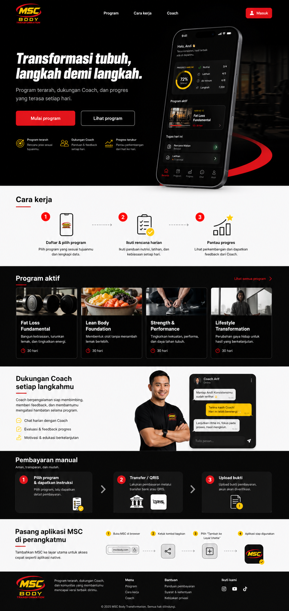
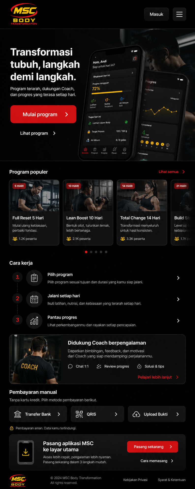

# Landing page visual references

Status: `Concept direction v1 — reference, not production pixels`  
Generated: `12 August 2026`  
Generator: built-in ImageGen (`gpt-image-2` path)

## Files

- `landing-desktop-concept-v1.png` — full-page desktop composition reference.
- `landing-mobile-concept-v1.png` — compact mobile landing composition reference.
- Source brand reference: `../../assets/brand/AppIcon-Default.png`; asal aset native dan hak distribusi dicatat di `../../assets/brand/README.md`.





## What is authoritative

These images are authoritative only for:

- high-level visual direction;
- black/red/yellow brand balance;
- hierarchy and section rhythm;
- mobile-product-led hero composition;
- restrained imagery, card density, and surfaces;
- overall quality bar.

They are not authoritative for:

- exact copy, prices, program names, participant counts, dates, or legal text;
- exact icon glyphs—production uses Phosphor through `MSCIcon`;
- exact PWA/mobile screen content—production compact UI follows the current iOS simulator and specs;
- claims, photography rights, Coach identity, or production assets;
- pixel dimensions and breakpoints.

Generated text and tiny UI details can contain visual approximations. Production implementation must use semantic HTML/React Native Web components, approved Indonesian copy, real data contracts, accessibility semantics, and the design tokens in `03_DESIGN_SYSTEM.md`.

## Prompt — desktop concept

```text
Use case: ui-mockup
Asset type: high-fidelity desktop landing page design reference for MSC Body Transformation PWA
Brand reference: approved iOS App Icon; preserve the MSC black, red orbit, yellow/red identity without redesigning it.
Create a polished full-page desktop landing page with header, mobile-product-led hero, Cara kerja, active programs, Coach support, manual payment, PWA installation, and footer.
Hero: “Transformasi tubuh, langkah demi langkah.”
Supporting copy: “Program terarah, dukungan Coach, dan progres yang terasa setiap hari.”
Actions: “Mulai program” and “Lihat program”.
Use near-black, off-white, #D92D20 red, #F5C542 accent yellow, generous spacing, refined system typography, restrained authentic fitness imagery, and selective translucent chrome.
Avoid generic fitness templates, medical claims, before/after bodies, exaggerated bodybuilders, neon, blue/purple SaaS colors, excessive gradients/glass, and logo redesign.
```

## Prompt — mobile concept

```text
Use case: ui-mockup
Asset type: high-fidelity 390 px mobile landing page reference for MSC Body Transformation PWA
Use the approved iOS App Icon as strict brand reference.
Create a premium full-length compact landing page with mobile header, hero, product preview, swipeable program cards, vertical Cara kerja, Coach support, manual payment, Add to Home Screen, and footer.
Use the same approved hero/support/action copy and palette as desktop.
Make it feel intentionally mobile and app-like, with readable hierarchy and realistic touch targets, not a shrunk desktop page.
Avoid generic templates, tiny desktop navigation, medical claims, before/after bodies, excessive gradients/glass, and logo redesign.
```

## Implementation review gate

Before Phase 01 is complete:

1. Compare the rendered landing page to both concepts.
2. Replace all generated photography with approved/licensed assets or intentionally generated production assets.
3. Verify copy against Product and legal decisions.
4. Compare compact app preview/navigation to the current iOS Simulator.
5. Obtain user visual sign-off before treating the landing design as final production direction.
