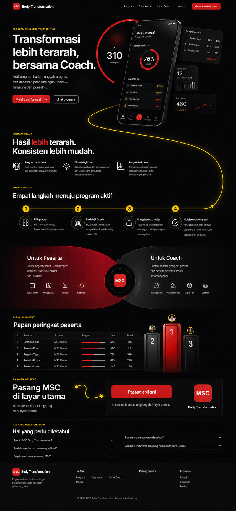

# Landing Page Design and Content

Dokumen ini menjadi source of truth untuk landing page publik MSC Body
Transformation. Mockup ImageGen adalah referensi hierarchy dan mood, bukan
gambar halaman yang ditempel sebagai production UI.



Konsep v3 adalah arah visual yang disetujui pada 11 Agustus 2026. Implementasi
tetap dibuat sebagai HTML/CSS responsif dan accessible; gambar konsep tidak
ditampilkan sebagai screenshot halaman produksi.

## Keputusan repository dan route

Landing page tetap berada di repository dan Next.js application yang sama:

```text
domain.tld/             -> landing page publik
domain.tld/hari-ini     -> aplikasi Peserta
domain.tld/coach-area   -> aplikasi Coach
domain.tld/admin        -> Admin
```

Implementasi target:

```text
src/app/(marketing)/page.tsx
src/app/(marketing)/layout.tsx
src/features/landing/
src/features/pwa-install/
```

Alasan:

- satu origin menjaga cookie Auth, OAuth callback, PWA scope, dan CSP sederhana;
- satu deployment Cloudflare Workers lebih murah;
- semantic tokens, localization, legal links, dan component primitives dapat
  dipakai bersama;
- landing tetap dipisahkan secara modul, bukan dicampur dengan feature Peserta,
  Coach, atau Admin;
- repo/deployment terpisah baru dipertimbangkan bila ada tim marketing,
  release cadence, CMS, atau ownership yang benar-benar independen.

## Tujuan halaman

1. Menjelaskan MSC sebagai program wellness terstruktur dengan pendampingan
   Coach fisik, bukan sekadar aplikasi digital.
2. Mengarahkan pengunjung ke program dan proses pendaftaran yang benar.
3. Membuat aksi memasang PWA mudah ditemukan tanpa mengklaim ada file aplikasi
   atau App Store.
4. Mengarahkan pengguna yang sudah masuk ke area sesuai role.
5. Membangun kepercayaan tanpa testimoni, statistik, atau hasil transformasi
   yang belum dapat dibuktikan.

## Navigation dan CTA

Header desktop:

- wordmark `MSC Body Transformation`;
- `Program` menuju katalog publik `/program`;
- `Cara kerja` menuju section langkah;
- `Untuk Coach` menuju penjelasan Coach;
- `Masuk` menuju `/masuk`;
- CTA utama adaptif; state custom install prompt memakai label `Unduh MSC`.

Mobile:

- header ringkas dengan wordmark dan menu;
- CTA install terlihat above the fold;
- sticky install bar hanya setelah hero CTA keluar viewport;
- sticky bar menghormati safe area dan tidak menutup form, dialog, atau footer.

## Copy production baseline

### Hero

```text
Transformasi lebih terarah, bersama Coach.

Ikuti program harian, unggah progres, dan dapatkan pendampingan Coach—langsung
dari ponselmu.

Unduh MSC
Lihat program
```

`Unduh MSC` adalah copy produk terbaru untuk state custom install prompt. State
iPhone/manual, standalone, unsupported, dan not-ready tetap memakai label
adaptif yang jujur; CTA tidak menawarkan APK atau IPA.

### Benefits

```text
Program terstruktur
Ikuti rencana harian yang jelas dan konsisten sesuai programmu.

Didampingi Coach
Dapatkan arahan dan pendampingan dari Coach yang terhubung dengan programmu.

Progres lebih jelas
Pantau penyelesaian langkah, status pemeriksaan, poin, dan perkembangan program.
```

Hindari kata `profesional`, `tersertifikasi`, atau klaim kompetensi lain sampai
ada bukti dan definisi operasional yang disetujui.

### Cara mulai

```text
1. Pilih program
Lihat jadwal, aktivitas, harga, dan ketentuan program.

2. Pindai QR Coach
Hubungkan pendaftaran dengan Coach pendamping melalui QR.

3. Unggah bukti transfer
Transfer ke rekening resmi, lalu unggah bukti pembayaran secara privat.

4. Mulai setelah disetujui
Akses program aktif setelah pembayaran diperiksa dan pendaftaran disetujui.
```

### Peserta dan Coach

```text
Untuk Peserta
Jalani langkah harian, kirim progres, dan lihat statusmu dalam satu aplikasi.

Untuk Coach
Pantau peserta yang ditugaskan dan periksa aktivitas sesuai kewenanganmu.
```

Jangan menyatakan Coach dapat melihat seluruh pengguna, bukti pembayaran,
foto, atau berat. Copy harus mengikuti RLS dan capability authoritative.

### Install callout

```text
Pasang MSC di layar utama
Akses lebih cepat dan pengalaman yang terasa seperti aplikasi, tanpa App Store.

Unduh MSC
Akses lebih cepat langsung dari layar utama.
```

### FAQ baseline

```text
Apa itu MSC Body Transformation?
MSC adalah program kebiasaan hidup sehat dengan aktivitas terstruktur dan
pendampingan Coach. Program ini bukan pengganti diagnosis atau perawatan medis.

Apakah saya harus memasang aplikasi?
Tidak. MSC tetap dapat digunakan melalui browser. Pemasangan ke layar utama
bersifat opsional agar akses lebih cepat.

Bagaimana cara memasang MSC?
Langkah pemasangan menyesuaikan perangkat dan browser yang sedang digunakan.

Bagaimana pembayaran diperiksa?
Setelah transfer, bukti pembayaran diperiksa oleh Admin. Akses program baru
aktif setelah pembayaran dan pendaftaran disetujui.

Apakah pembayaran langsung menjadikan saya Coach?
Tidak. Pembayaran terverifikasi dan persetujuan Coach adalah proses terpisah.
```

Footer minimal: `Privasi`, `Ketentuan`, `Bantuan`, dan wellness disclaimer.

## Install CTA state matrix

Tidak ada satu tombol download universal untuk PWA. CTA memakai state machine
feature-detected dan copy yang jujur.

| State | Label utama | Aksi |
|---|---|---|
| Chromium install prompt ready | `Unduh MSC` | Panggil retained `beforeinstallprompt.prompt()` |
| iPhone/iPad browser, belum standalone | `Cara memasang di iPhone` | Buka sheet langkah Share lalu Add to Home Screen |
| Browser installable tanpa custom prompt | `Cara memasang` | Buka petunjuk browser-specific yang telah diuji |
| Sudah standalone/installed | `Buka aplikasi` | Arahkan ke destination sesuai session/role |
| Tidak mendukung instalasi | `Gunakan di browser` | Arahkan ke `/masuk` atau katalog publik |
| Manifest/service worker belum siap | `Gunakan di browser` | Jangan menampilkan success/prompt palsu |

Rules:

- label `Unduh MSC` hanya digunakan untuk custom install prompt sesuai
  keputusan produk terbaru; tidak boleh menyiratkan unduhan APK/IPA;
- install UI disembunyikan/diadaptasi bila app sudah standalone;
- jangan user-agent sniffing sebagai satu-satunya kebenaran;
- jangan menyimpan install prompt event, token, atau session ke persistent
  storage;
- dismissal tidak diulang agresif pada setiap page view;
- analytics install hanya event allowlist tanpa email, user ID, atau PII;
- instruksi iOS mengikuti UI browser versi yang benar dan diverifikasi pada
  physical device sebelum release.

## Visual system

- Near-black untuk header, identity surface, dan install callout terbatas.
- Merah semantic brand untuk satu CTA utama per viewport.
- Kuning hanya untuk achievement/accent kecil dengan teks near-black.
- Reading sections memakai near-black berlapis dengan border/kontras yang
  cukup; merah dan kuning tetap aksen, bukan warna dasar semua panel.
- Landing memakai Poppins melalui `next/font` dengan system fallback dan
  responsive type; font di-self-host oleh build dan tidak menyalin raster text
  dari mockup.
- Jalur progres desktop harus berupa kurva tunggal yang halus dari hero dan
  menyatu pada garis langkah tepat setelah langkah 4. Panah callout instalasi
  memakai kurva S bertitik, bukan siku patah. Dekorasi jalur disederhanakan pada
  mobile agar tidak mengganggu isi.
- Hero people imagery harus inklusif, realistis, tidak memakai before/after,
  tidak mempermalukan tubuh, dan tidak menjanjikan hasil tertentu.
- Phone/dashboard preview memakai data fiktif non-PII yang jelas sebagai
  product preview, bukan akun nyata.

## Placeholder dan screenshot aplikasi final

Selama screenshot PWA terbaru belum disetujui untuk komposisi landing v3, area
preview aplikasi pada hero memakai placeholder. Mockup ImageGen v3 menunjukkan komposisi dan
hierarchy placeholder tersebut, bukan screenshot produk final.

Aturan placeholder:

- gunakan frame/surface sederhana berlabel aksesibel `Pratinjau aplikasi`;
- boleh menampilkan skeleton, ilustrasi UI generik, atau mock data non-PII;
- jangan menampilkan screenshot iOS lama seolah-olah merupakan PWA final;
- jangan menampilkan fitur, menu, statistik, Coach credential, atau status yang
  belum ada dalam contract;
- ukuran dan aspect ratio harus sudah dikunci agar penggantian asset tidak
  menyebabkan layout shift;
- placeholder tidak boleh masuk Open Graph image atau materi iklan sebagai
  bukti tampilan produk yang sudah tersedia;
- jika landing dipublikasikan sebelum screenshot final siap, beri label
  `Pratinjau aplikasi` atau sembunyikan preview; jangan menyesatkan pengunjung.

Screenshot final baru menggantikan placeholder setelah layar terkait selesai
dan lulus parity serta visual review. Capture dilakukan dari PWA sebenarnya,
bukan dari mockup ImageGen atau source iOS.

Capture set minimum:

```text
Peserta  -> Hari ini/program aktif pada viewport ponsel
Coach    -> Dashboard atau pemeriksaan pada viewport ponsel
Admin    -> Dashboard pada viewport desktop, bila digunakan di landing
```

Aturan capture final:

- gunakan deterministic marketing fixture yang tidak menyerupai orang nyata;
- tidak ada email, nomor HP, QR mentah, berat, bukti transfer, foto privat,
  signed URL, token, atau data production;
- copy, locale, status, dan navigation harus sama dengan build yang dirilis;
- capture pada viewport/DPR yang dipin dan simpan source metadata;
- crop tidak boleh mengubah makna status atau menyembunyikan error;
- optimalkan ke format web modern dengan fallback yang disetujui;
- ulangi capture bila UI material berubah setelah release candidate.

Placeholder dianggap selesai hanya setelah replacement task dan owner phase
final dicatat. Tidak boleh ada TODO tanpa phase tujuan.

## Content dan privacy boundaries

- Landing hanya memakai public-safe program summaries dan Coach public profile.
- Tidak ada enrollment, payment evidence, avatar privat, berat, submission,
  QR mentah, atau signed URL dalam HTML/cache landing.
- Public content dapat di-cache hanya setelah contract dan freshness disetujui.
- Personalized header cukup memakai state aman seperti `Buka aplikasi`; jangan
  CDN-cache HTML yang mengandung session/user.
- Link legal menggunakan endpoint/route resmi dan tidak diduplikasi sebagai
  hard-coded policy text yang mudah kedaluwarsa.

## SEO dan sharing

- Metadata Bahasa Indonesia: title, description, canonical, Open Graph, dan
  Twitter card setara.
- Sitemap hanya memuat public routes; Admin/Auth/private routes tidak masuk.
- `robots` tidak mengindeks `/admin`, Auth callback, pembayaran, dan personal
  routes.
- Structured data dibatasi pada fakta `Organization`/`WebSite` yang dapat
  diverifikasi; tidak ada rating, review, harga, atau klaim hasil palsu.
- Social preview dibuat sebagai asset terpisah; jangan menggunakan screenshot
  halaman penuh sebagai Open Graph image.

## Performance dan accessibility

- Hero copy dan CTA tetap usable sebelum JavaScript hydration.
- Image memiliki responsive sizes, explicit dimensions, modern format, dan
  focal point yang aman pada mobile.
- Sticky CTA tidak menyebabkan CLS dan tidak menutup konten pada zoom 200%.
- Heading hierarchy, landmarks, skip link, focus order, dan button name jelas.
- Motion dekoratif menghormati `prefers-reduced-motion`.
- Install sheet dapat ditutup dengan keyboard, mengembalikan focus, dan
  diumumkan oleh screen reader.
- Uji light/dark, 320 px width, text zoom, high contrast, keyboard, VoiceOver,
  TalkBack, dan network lambat.

## ImageGen provenance

- Mode: built-in ImageGen.
- Taxonomy: `ui-mockup`.
- Output terpilih: `landing-page-concept-v3.png`, 853 × 1844 PNG.
- SHA-256:
  `9dd04f71768fbd0284b1c06fa5c65f6a6f7a0690d144cce5acb60b59c07a93fb`.
- Prompt intent: landing performance digital dengan kanvas near-black,
  tipografi besar, garis progres kuning 1–4, placeholder PWA berlapis, panel
  Peserta/Coach yang saling mengunci, leaderboard visual, dan CTA tunggal.
- Revision v3 menghapus section program dari landing, mengarahkan katalog ke
  `/program`, menghapus CTA sekunder pada panel peran/leaderboard, dan mengubah
  install tutorial menjadi satu CTA.

Mockup tidak boleh digunakan sebagai production screenshot tanpa visual,
copy, accessibility, consent/licensing, dan responsive review ulang.

## Sumber perilaku instalasi

- MDN custom install prompt:
  https://developer.mozilla.org/en-US/docs/Web/Progressive_web_apps/How_to/Trigger_install_prompt
- MDN installability/browser support:
  https://developer.mozilla.org/en-US/docs/Web/Progressive_web_apps/Guides/Making_PWAs_installable
- Apple Add to Home Screen:
  https://support.apple.com/en-gb/guide/iphone/iphea86e5236/ios
